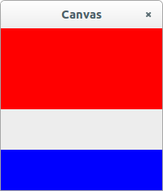

# Drawing on Canvas

Generic (Cairo) drawing is done on a `Canvas`. You control what appears on this canvas by defining a `draw` function:

```julia
using Gtk4, Graphics
c = GtkCanvas()
win = GtkWindow(c, "Canvas")
@guarded draw(c) do widget
    ctx = getgc(c)
    h = height(c)
    w = width(c)
    # Paint red rectangle
    rectangle(ctx, 0, 0, w, h/2)
    set_source_rgb(ctx, 1, 0, 0)
    fill(ctx)
    # Paint blue rectangle
    rectangle(ctx, 0, 3h/4, w, h/4)
    set_source_rgb(ctx, 0, 0, 1)
    fill(ctx)
end
```
This `draw` function will get called each time the window gets resized or otherwise needs to refresh its display.



See Graphics.jl's or Cairo.jl's documentation for more information on graphics.

Errors in the `draw` function can corrupt Gtk4's internal state; if
this happens, you have to quit julia and start a fresh session. To
avoid this problem, the `@guarded` macro wraps your code in a
`try/catch` block and prevents the corruption. It is especially useful
when initially writing and debugging code.

Mouse events can be handled using event controllers. The event controller for
mouse clicks is GtkGestureClick. We first create this event controller, then
add it to the widget using `push!`.

```julia
g=GtkGestureClick()
push!(c,g)

function on_pressed(controller, n_press, x, y)
    w=widget(controller)
    ctx = getgc(w)
    set_source_rgb(ctx, 0, 1, 0)
    arc(ctx, x, y, 5, 0, 2pi)
    stroke(ctx)
    reveal(w)
end

signal_connect(on_pressed, g, "pressed")

```

This will draw a green circle on the canvas at every mouse click.
Resizing the window will make them go away; they were drawn on the
canvas, but they weren't added to the `draw` function.
