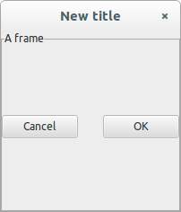

# Layout

You will usually want to add more than one widget to your application. To this end, Gtk4 provides many layout widgets.

!!! note
    For larger projects it is advisable to create the layout using Glade in combination with GtkBuilder. See [Builder and Glade](@ref).

## GtkBox

The most simple layout widget is the `GtkBox`. It is one-dimensional and can be either be horizontally or vertical aligned.
```julia
win = GtkWindow("New title")
hbox = GtkBox(:h)  # :h makes a horizontal layout, :v a vertical layout
push!(win, hbox)
cancel = GtkButton("Cancel")
ok = GtkButton("OK")
push!(hbox, cancel)
push!(hbox, ok)
```

This layout may not be exactly what you'd like. Perhaps you'd like the `OK` button to fill the available space, and to insert some blank space between them:

```julia
ok.hexpand = true
hbox.spacing = 10
```
The first line sets the `hexpand` property of the `ok` button within the `hbox` container. The second line sets the `spacing` property of `hbox` to 10 pixels.

Note that these aren't evenly sized, and that doesn't change if we set the `cancel` button's `expand` property to `true`. The `homogeneous` property of `hbox` can be used to achieve this.

```julia
hbox.homogeneous = true
```

Now we get this:



which may be closer to what you had in mind.

## GtkGrid

To create two-dimensional (tabular) layouts of widgets, you can use `GtkGrid`:
```julia
win = GtkWindow("A new window")
g = GtkGrid()
a = GtkEntry()  # a widget for entering text
a.text = "This is Gtk!"
b = GtkCheckButton("Check me!")
c = GtkScale(false, 0:10)     # a slider

# Now let's place these graphical elements into the Grid:
g[1,1] = a    # Cartesian coordinates, g[x,y]
g[2,1] = b
g[1:2,2] = c  # spans both columns
g.column_homogeneous = true
g.column_spacing = 15  # introduce a 15-pixel gap between columns
push!(win, g)
```

The `g[x,y] = obj` assigns the location to the indicated `x,y` positions in the grid
(note that indexing is Cartesian rather than row/column; most graphics packages address the screen using
Cartesian coordinates where 1,1 is in the upper left).
A range is used to indicate a span of grid cells.
By default, each row/column will use only as much space as required to contain the objects,
but you can force them to be of the same size by setting properties like `column_homogeneous`.

## GtkCenterBox

The `GtkCenterBox` widget can hold 3 widgets in a line, either horizontally or
vertically oriented. It keeps the middle widget centered. Child widgets can be set and accessed like this:
```julia
cb = GtkCenterBox(:h)   # :h makes a horizontal layout, :v a vertical layout
cb[:start] = GtkButton("Left")
cb[:center] = GtkButton("Center")
cb[:end] = GtkButton("Right")
```
For vertical orientation, `:start` refers to the top widget and `:end` to the
bottom widget.

## GtkPaned

The `GtkPaned` widget creates two slots separated by a movable divider. Like `GtkBox`, it can
be oriented either vertically or horizontally. To add child widgets, you can use
```julia
paned = GtkPaned()
paned[1] = top_or_left_widget
paned[2] = bottom_or_right_widget
```

## GtkNotebook

The `GtkNotebook` widget places child widgets in tabs like a browser window.
Child widgets can be inserted with a label like this:
```julia
nb = GtkNotebook()
vbox = GtkBox(:v)
hbox = GtkBox(:h)
push!(nb, vbox, "Vertical")  # here "Vertical" is the label for the tab
push!(nb, hbox, "Horizontal")
```

## Iterating over child widgets

For any of the widgets described above (or any `GtkWidget`), you can iterate over all child widgets using
```julia
for w in widget
    myfunc(w)
end
```
